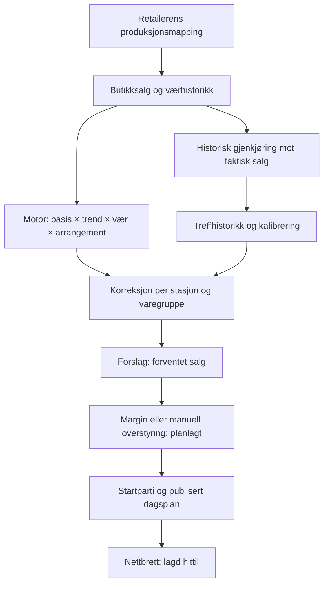

# Produksjonsplan: beregning, publisering og selvlæring

Gjennomgått 17. september 2026. Analysegrunnlag: `11de466`. Tallprøvene nedenfor er kontrollerte eksempler kjørt mot faktisk motor; de sier ikke hvor stor feilen er i en bestemt butikk.

## Retting etter godkjenning

Produksjonsrettelsene er implementert på `produksjonsplan-korrekt`: atomisk komplett plansnapshot og bekreftet lederlagring, aggregering per dag, komplette referansevinduer, historisk salgscutoff, Oslo-dato, felles helligdagsreferanse, retailerbundet mapping og atomisk historikk/kalibrering. Migrasjon 0222 og 0223 er lokalt testet; brukeren bekreftet SQL-kjøring i produksjon før deploy. Nye regresjoner beviser at de tidligere 20→10 og 10→13-feilene nå gir 20 og 10.

Treffvisningen er tydelig merket som råmodellens historiske scenariomåling. Den er ikke omgjort til et arkiv over forhåndsvarsler eller et selvstendig bevis på fremtidig forbedring. Margin og svinn holdes fortsatt atskilt fra kalibreringen. Riktig kategori følger retailerens mapping. Manglende svar gir feil fremfor en falsk standardmodell.

Resten av dokumentet beskriver funnene før retting og begrunnelsene. Faktisk fremtidig forbedring må fortsatt etterprøves på senere dager med informasjonen som var kjent før dagen.

## Vurdering

Arkitekturen har gode byggesteiner: ren beregningsmotor, butikkens salg uten drivstoff, separat produksjonsmargin og startparti, og stasjonsvis kalibrering. Jeg ville likevel ikke godkjent beregningen og selvlæringen som ferdig etterprøvd. To beregningsfeil er demonstrert numerisk. Publisering har en brist mellom forslagene lederen ser og linjene nettbrettet leser. Backtesten bruker dessuten andre forutsetninger enn liveplanen.

## Hvordan det henger sammen

Motoren bruker median av relevante fjorårsdager, eller nylig salg for nye produkter. Store avvik kan blande fjorår og nylig salg 50/50. Samlet trend begrenses til 0,6–1,6. Vær og bekreftede arrangementer påvirker forslaget. Deretter anvendes kategoriens kalibrering, før lederen setter margin og startparti.

| Tall | Hva det betyr |
|---|---|
| Forslag | Forventet solgt antall, etter kalibrering på lederflaten |
| Planlagt | Produksjonsmål, med margin eller lederens overstyring |
| Start | Del av dagsplanen som skal være klar ved åpning |
| Lagd hittil | Ansattes registrerte produksjon |
| Treffhistorikk | Gjenberegnet råprognose sammenlignet med salg; ikke evaluering av den lagrede, publiserte planen |

## Viktigste funn

### 1. Publisering kan mangle planlinjene — P1

`page.tsx` bygger forslag i minnet. `PlanTabell` lagrer linjer ved redigering og ved «bruk prosent på planen», men publiseringsknappen sender bare stasjon og dato. `publiser()` i `handlinger.ts:54` skriver bare `produksjonsplan_hode` med publiseringstid.

En ny, urørt plan kan derfor få publisert hode uten linjer. Nettbrettet leser lagrede linjer, ikke lederens beregnede forslag. Delvis redigering kan gi bare de redigerte produktene. Tom plan kan dessuten vises som «Alt er lagd» ved 0/0.

Direkte demonstrasjon: den faktiske `PlanTabell` ble montert i jsdom med to urørte produkter, og den faktiske publiseringshandlingen ble kjørt med mock for auth og database. Klikket skrev ett publisert hode, **null produktlinjer**, og grensesnittet viste «Synlig på nettbrettet». Dette beviser skrivebanen; det var ingen produksjonsskriv.

Rettelse: lagre et komplett, validert plansnapshot og bekreft publisering først når dette er lagret. Bevar registrert produksjon. Test ny dato med to urørte produkter, delvis redigering, lagringsfeil og gjenpublisering.

Kilder: `src/app/(beskyttet)/produksjonsplan/page.tsx:300`, `plan-tabell.tsx:140`, `handlinger.ts:54`.

### 2. Nylig salg snittes per rå rad, ikke per dag — P1

Motoren summerer fjoråret per produkt og dato, men legger nylige råsalgsrader direkte i en liste. Snittet regnes over radene. Flere EAN med samme varenavn kan gi flere legitime rader på samme dag.

Demonstrert med faktisk motor: to salgsrader på 10 + 10 per relevant dag gir forslag **10**; én samlet rad på 20 per dag gir **20**. Dagsvolumet er identisk. Splittede rader påvirker også grensen for «nok data».

Rettelse: aggreger samme produkt og dag før snitt og observasjonstelling. Avklar også produktidentiteten dersom forskjellige produkter har samme navn. Test at fordeling på EAN-rader ikke endrer dagsforslaget.

Kilde: `src/lib/produksjonsplan.ts:139`, `:170`.

### 3. Importetterslep kan lage falsk vekst — P1

Liveplanen henter historikk fra måldato minus 392 dager. Trendens fjorårsvindu bestemmes derimot av siste faktiske salgsdato minus 364. Disse dekker ikke alltid samme periode.

Demonstrert: stabilt salg 10/dag i begge 28-dagersperiodene gir korrekt trend **1,00** og forslag **10**. Med sju dagers etterslep og sidens hentestart mangler seks fjorårsdager: trend **1,27**, forslag **13**. Ingen ferskhetsadvarsel utløses, fordi dagens advarsel først kommer etter ti dager.

Rettelse: utled hentestart fra alle faktiske referansevinduer, og krev sammenlignbar dekning. En ukjent eller ufullstendig referanse skal ikke tolkes som lavere salg. Test flere etterslep og perioder rundt helligdager.

Kilder: `page.tsx:229`, `src/lib/produksjonsplan.ts:143`.

### 4. Backtest og liveplan er forskjellige modeller — P1/P2

Live sender navngitt fjorhelligdag og arrangementfaktor; produksjonsbacktesten sender ingen av delene. For 17. mai 2026 kan −364 peke på 18. mai 2025, mens live bruker 17. mai 2025. Backtesten vurderer råforslaget, mens live også ganger inn kalibrering.

Eksempel: råprognose 100 mot faktisk salg 80 lærer korreksjon ×0,8. Live viser 80, men treffhistorikken vurderer fortsatt 100. Treffvisningen beviser dermed ikke at den korrigerte prognosen forbedres.

Rettelse: én felles kontrakt for modellens input og versjon. Vis råmodell og korrigert modell separat. Mål forbedring på senere, urørte dager, med faktor trent kun på tidligere dager. Historiske arrangementer må håndteres med informasjonen som var kjent da.

Kilder: `src/lib/backtest.ts:119`, `page.tsx:283`, `:285`.

### 5. Kjedens produksjonsmapping må bindes under serviceklient — P1

Backtesten henter produksjonskoder via en helper som bygger på RLS. Nattjobb og manuell backtest bruker serviceklient, som går forbi RLS. Da kan helperen hente mapping fra flere retailers.

Salget er fortsatt filtrert på stasjonen. Dette er en feil i modellutvalg; analysen beviser ikke lekkasje av andre butikkers salg til brukeren.

Rettelse: eksplisitt retailerfilter i helperen under servicekjøring. Test to kjeder med forskjellige mappings gjennom samme serviceklient.

### 6. Historiske resultater kan være etterpåkloke — P2

Historisk dagvalg på lederflaten bruker siste salg uten grense før måldagen. Backtesten filtrerer salg riktig til `< D`, men bruker dagens lærte værprofiler og måldagens faktiske vær. Værprofilen kan være trent også på dager etter historisk D.

Dette er ikke et rent bevis på prognosen man kunne ha laget før dagen. Faktisk vær kan være nyttig til en tydelig merket etteranalyse, men må skilles fra treff på et forhåndsvarsel.

Rettelse: historiske planer bør vise lagret snapshot, eller klart merket etterberegning. En kausal test skal ikke endres når fremtidig salg eller fremtidige værdata endres. Værvarsler må arkiveres dersom faktisk prognosetreff skal måles.

Kilder: `page.tsx:225`, `src/lib/backtest.ts:114`, værprofilen i `supabase/migrations/0151_vaerprofil_uten_drivstoff.sql`.

## Hva selvlæringen faktisk gjør

Den lærer en korreksjon `sum(faktisk salg) / sum(rått forventet salg)` per stasjon og kategori. Minst åtte gyldige dager kreves; korreksjonen begrenses til 0,6–1,6. Værprofilen lærer korrelasjoner fra historikk, justert for ukedag. Medianvindu, kampanjeterskler og selve værformelen er faste regler.

Den lærer **ikke direkte av faktisk lagd antall, svinn eller utsolgt-registreringer**. Disse driftsdataene må ikke fremstilles som dagens læringsfasit.

Svinn holdes med vilje utenfor nedjustering av prognose og margin. Dette er et godt vern: mindre produksjon gir mindre svinn, som ellers kunne fått modellen til å redusere produksjonen igjen. Ikke fjern dette skillet. Samtidig er salg begrenset av lager: etterspørsel 140 med bare 100 tilgjengelig gir observert salg 100. Salg alene beviser ikke at behovet var 100. Utsolgt bør kvalifisere observasjonen og usikkerheten.

Kategorisummer kan skjule feil mellom produkter: for mye av ett produkt og for lite av et annet kan gi riktig totalsum. Produkttreff, utsolgt og svinn bør derfor være separate kontrollmål.

## Andre forhold som bør rettes

- Lederens linje-, prosent- og notatskriving bruker flere ubekreftede `void`-kall uten rollback. Publisering bør vente på vellykket lagring, og meldinger bør gjenspeile faktisk resultat.
- Backtesten sletter treff og kalibrering før nye rader settes inn, uten atomisk utskifting. En skrivefeil kan gi tom eller delvis historikk. Gammel gyldig kalibrering bør bevares til hele den nye er bekreftet.
- Kalibreringen utelater både forventet og faktisk ≤0. Bekreftet nullsalg må skilles fra manglende import før denne regelen vurderes.
- På helligdager bruker værreferansen fortsatt −364, selv om salgsreferansen følger navngitt helligdag.
- Lederens morgendato bruker UTC-basert datostreng, mens tablet bruker Oslo-dato. Samme stasjonsdato bør brukes overalt.
- Manuelt startantall kan overstige planlagt antall. Avklar og valider regelen `start ≤ planlagt`.
- Metodeteksten sier stasjonstype bestemmer produksjonens værutslag, men denne motoren mottar ikke stasjonstype. Basis kalles også «Snitt» selv når den er median eller blanding.
- St1-koder og kategorinavn er hardkodet i enkelte forklaringer, selv om produksjonsmappingen er retaileravhengig.
- Flere sidehentinger bruker standardverdier når databasekall feiler. Ukjent lagret plan og ukjent konfigurasjon må skilles fra et reelt tomt utkast.

## Anbefalt rekkefølge

1. Publiser hele planen med bekreftet lagring og korrekt tabletvisning.
2. Rett dagsaggregering og komplette referansevinduer.
3. Bind servicekjørt mapping til riktig retailer.
4. Samle live og backtest om samme modellkontrakt; bevar gammel kalibrering ved skrivefeil.
5. Mål før/etter-kalibrering på en separat senere periode, med utsolgt og datadekning synlig.
6. Rydd dato, begrunnelser, startvalidering og kategori-/produktvisning.

Eksisterende motor- og grensevakter består, men dekker ikke de demonstrerte rad-/vindu-feilene eller hele publiseringskjeden. Nye direkte regresjoner bør bevise invariantene før retting; grønn eksisterende suite alene er ikke tilstrekkelig.

Onboardingpåvirkning: NEI — denne gjennomgangen endrer ingen funksjon eller oppsett. Ved implementering må vurderingen gjøres på nytt. Nåværende behov er retailerens produksjonsmapping, relevant historikk og butikkens margin/startvalg; ingen ny integrasjon er foreslått som krav her.
