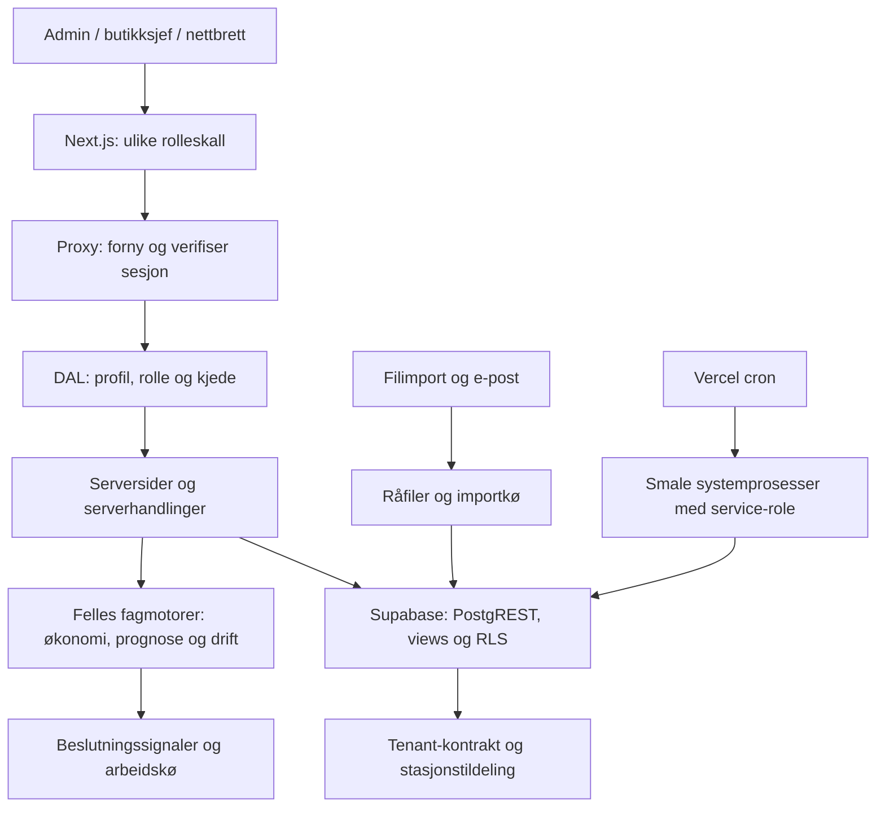

# Sentiqa: samlet systemanalyse 17. september 2026

## Vurdering

Sentiqa trenger først mer pålitelige signaler og mer sammenhengende navigasjon, deretter en utprøvd omorganisering av menyen. Systemet har mange moduler som hører sammen i brukerens arbeidsflyt, men som har forskjellige regler og derfor ikke bør slås sammen til én generell funksjon. Det er også konkrete kodebaner hvor feil eller ufullstendige data blir til normale tomme svar. Dette er mer alvorlig enn antallet menypunkter.

Tre parallelle agenter undersøkte admin, butikksjef og navigasjon, og tok deretter egne gjennomganger av integrasjoner, datakjeder og tablet. Hovedagenten undersøkte deploy, proxy/DAL, identitet, feilrapportering, helse, PWA og testoppsett og samlet resultatene. Kartleggingen fant 80 sidefiler og 14 API-rutefiler. Dette er en bred kildekodeanalyse med lokal verifikasjon; ikke en attest på at alle funksjoner virker i produksjon.

## Arkitekturen

Publiseringsstatus: tidligere godkjente PR 313 ble squash-merget til `fa45fd937d86e92b3f9083189662217efc1accab`. Vercel rapporterte vellykket deploy. `https://sentiqa.ai/api/health` svarte `healthy`, database ok og versjon `fa45fd9` 2026-09-17 kl. 16:30 UTC. Innloggingssiden svarte HTTP 200. Tablet-ytelsesendringen og denne analysens dokumenter er fortsatt lokale; forslagene er ikke implementert eller publisert. Helse og HTTP 200 er ikke en full produksjonsgjennomgang av alle roller.

Gode fundamenter som bør bevares: databasehåndhevede tenantgrenser, egen tablet-rolle, felles økonomisammenstiller, eksplisitt ukjent datagrunnlag flere steder, rolle-/rutevakter og databaseatferdsmatriser. Menyen er ikke autorisasjonen. Plattformredaktøren skal fortsatt ikke lese butikkens forretningsdata.

## Prioritert tiltaksplan

P1 betyr høy konsekvens eller fare for et misvisende beslutningssignal. P2 betyr viktig brukbarhet eller skalerbarhet. Produksjonsforekomst er ikke målt med mindre det sies eksplisitt.

| Prioritet | Kodefunn | Konsekvens | Konkret neste endring og bevis |
|---|---|---|---|
| P1 | Datadekning og flere liste-/bemanningsflater ignorerer query-error | Feil kan se ut som normal tomhet eller «ingen hull» | Skill feil, tomt og avkortet. Injiser databasefeil i direkte tester; grønt skal kreve kjent grunnlag |
| P1 | Dashboard følger valgt stasjon bare for noen oppslag | Overskrift og tall kan dekke forskjellige stasjoner | Klassifiser kort som valgt stasjon eller samlet område. Test to tildelte stasjoner med forskjellig ferskhet |
| P1 | Rutinebrøk teller alle rutiner mot dagens utføringer | Gjennomføring kan se dårligere ut enn den er | Del forventningsregelen, men behold skillet mellom hele dagen og vakten nå. Test frekvens og nattvakt |
| P1 | Salgsprognose bruker −364 dager også ved helligdager | UI lover en referanse motoren ikke bruker | Bruk samme navngitte helligdagskontrakt som produksjonsmotoren. Test både 17. mai og bevegelig påske |
| P1 | Lønnshenting ber om større grenser enn serverens radtak uten fullstendighetsvern | Delvis grunnlag kan inngå i økonomien | Stabil paginering og avkortingsvern; test mer enn 1 000 rader |
| P1 | Råfil og importjobb opprettes separat; jobbfeil håndteres utilstrekkelig | Fil kan bli deduplisert uten å bli behandlet | Atomisk innlegging eller gjenopprettbar tilstandsmaskin. Test krasj mellom ledd og ny levering |
| P1 | Full brukssynk kan få tomme kildelister ved query-error | Kontrollrommet kan få et feilaktig komplett tomt bilde | Avbryt fullsynk ved ukjent kilde; test feil versus ekte tom kjede |
| P1 | Tablet-produksjon tillater samtidige absolutte skriver | Siste ankomne svar eller rollback kan gi feil mengde | Serialiser eller bruk atomisk delta med idempotens. Test omvendt svarrekkefølge |
| P1 kandidat | Vaktkapsel signerer id, men ikke utløpstid eller sesjon | Tidligere gyldig verdi har ingen serverkontrollert levetid | Bevis replay med kontrollert klokke først. Signer utstedelse/utløp og valgt identitetskontekst |
| P1/P2 | Tablet kan tildeles flere stasjoner; importkrav bruker ikke bilvask-relevans | Stasjonsprinsipp og onboarding kan sprike fra produktbehov | Avklar én tablet/én stasjon og test opprett/endring. Utled importkrav fra modulens konfigurasjon |
| P2 | Søk indekserer meny, men ikke alle faner | Funksjoner finnes, men er vanskelige å finne | Én rollefiltrert navigasjonsgraf for søk, meny og rekkeviddevakt |
| P2 | Aktiv hovedgruppe følger ikke faner med annen URL | Brukeren mister orienteringen | Beregn forelder fra fanegruppen; test alle faner og dyplenker |
| P2 | Mobilmeny/palett mangler full fokusstyring | Skjulte lenker kan få fokus; modalitet er ufullstendig | Test tastatur, fokusretur og skjermleser i ekte nettleser |
| P2 | Klientstate initialiseres fra props uten generell synkronisering | Polling er ikke alltid nok til å vise nye data | Definer policy for ferske serverdata versus pågående redigering; test en annen enhets endring |
| P2 | Ukebrief sendes før utsending registreres | Krasj/samtidighet kan gi dobbelt utsending | Provider-idempotens og atomisk claim; feilinjeksjon før/etter sending |

Flere funn og filreferanser finnes i delrapportene. Ingen av sikkerhetskandidatene er omtalt som et demonstrert produksjonsangrep. Et bredt RLS-omfang innenfor tildelte stasjoner er heller ikke i seg selv en fremmed-tenant-lekkasje.

## Overlapp og anbefalt meny

Det er fire viktige arbeidsflyter som bør bli tydeligere:

1. **Produksjon og varer:** forslag → produksjon → utsolgt/svinn → treffsikkerhet → justering. Samme kontekst for stasjon, periode og vare gjennom hele sløyfen.
2. **Arbeid og kontroll:** én oversikt over oppgaver, rutiner, sjekkpunkt og IK-mat. Behold de ulike fagreglene, fristene, ansvar og dokumentasjonskravene.
3. **Økonomi og oppfølging:** månedens bilde → forklaring → eiergodkjent plan → utførelse. Avklar Fokus mot månedsplanens råd, og merk automatisk råd versus godkjent tiltak.
4. **Team:** ansatte/avtaler → bemanning/lønn → opplæring → anerkjennelse. Kommunikasjon må skille butikkmelding, privat innspill, publisert innhold og systemvarsel.

| Rolle | Forslag til primærområder |
|---|---|
| Retailer-admin | Kjeden · Drift · Økonomi · Team · Kommunikasjon · Oppsett |
| Butikksjef | Butikken min · Daglig drift · Salg og økonomi · Team · Oppfølging · Innstillinger |
| Tablet | Behold I dag · Rutiner · Hjelp; forbedre orientering og stabile arbeidsinnganger |
| Plattformredaktør | Behold eget plattformområde og egen tilgangsgrense |

Dette er en konkret skisse til prototype, ikke en ferdig brukervalidert meny. Begynn med søk og aktiv markering; de er reelle feil uansett ny struktur. Ikke flytt alt inn i fanegrupper med ti valg. Bevar ruter og dyplenker mens innganger omorganiseres.

En gammel kommentar hevder at Min måned og Min plan viser hele samme plan. Dagens kode gjør allerede en kort oppsummering på månedssiden og viser full plan på plansiden. Den historiske kommentaren er ikke grunnlag for å fjerne funksjonen.

## Ytelse, tester og begrensninger

Tablet-forbedringen er implementert lokalt: I dag går fra 27 til 17 Supabase-/auth-kall, og median full serverrespons går fra 1 625 til 1 155 ms i et lokalt produksjonsbygg med kontrollert 150 ms forsinkelse per kall. Dette er omtrent 29 % kortere svartid i denne testen. Rutinesiden fikk ingen dokumentert tidsgevinst. Se egen målerapport og rådata.

Det forbedrede lokale bygget bestod 65 nettlesertester for tablet og oppfriskning. Typer, lint og produksjonsbygg bestod; produkttestkjøringen bestod 4 131 tester og hoppet over 18 integrasjonsmålinger uten legitimasjon. En ny direkte test for Request-identitet ble senere lagt til og bestod separat. To private lokale lønnsmålinger inngår ikke i produktets testpakke og er ikke publisert.

En ekstra lokal oppfriskningskjøring med `--no-deps` kunne ikke starte gyldige tester: Playwright ryddet auth-state-filen som normalt opprettes av setup. De fem feilene fra denne kjøringen er derfor manglende testforutsetning, ikke bevis på fem produktfeil. Den samme rettede loggkoden bestod GitHub-nettleserjobben før merge.

RLS-vakthunden bestod mot fersk lokal base. PR 313 bestod begge påkrevde CI-jobber, Vercel-preview og agentreview før merge. Disse kontrollene beviser repoets testverden; produksjonsmigrasjoner kjøres manuelt og kan avvike. Helseendepunktet bruker service-role, så grønn databasehelse beviser verken kundens RLS-tilgang eller importferskhet. PWA-serviceworker har ingen offlinecache eller registreringskø.

Før større redesign: prøv konkrete oppgaver med faktiske adminer, butikksjefer og ansatte. Mål tid, feilvalg, hjelp og tap av registrering. Ta med ulik erfaring, syn/motorikk, nettbrettmodell og butikknett. Vi har ikke målt produksjonens LCP/INP, langsom Wi-Fi, eksterne integrasjoners faktiske kjøring eller alle språk på fysiske enheter.

## Delrapporter

- [Admin og plattform](analyse-admin-2026-09-17.md)
- [Butikksjef](analyse-butikksjef-2026-09-17.md)
- [Navigasjon og menyskisser](analyse-navigasjon-2026-09-17.md)
- [Integrasjoner, import og drift](analyse-integrasjoner-2026-09-17.md)
- [Økonomiske datakjeder](analyse-datakjeder-2026-09-17.md)
- [Tablet gjennom hele vakten](analyse-tablet-helhet-2026-09-17.md)
- [Tablet-arkitektur og målte forbedringer](tablet-arkitektur-2026-09-17.md)

Onboardingpåvirkning: NEI for selve analysen og tablet-ytelsesendringen. Forslaget om bilvask-relevans vil påvirke hvilke oppstartskrav som skal vises og skal få egen onboardingvurdering ved implementering. Menyskissen innfører ingen nye datakrav.
