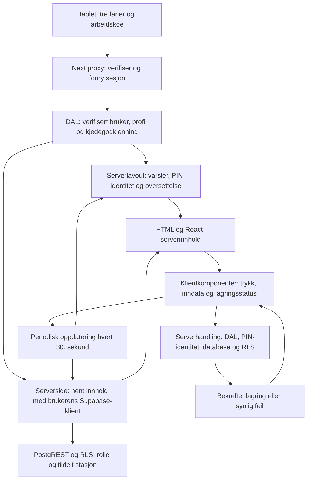

# Tablet: arkitektur og maalt forbedring

## Resultat

`/oversikt` («I dag») brukte 27 database-/auth-kall for en enkelt full sidelasting. Etter rettingen bruker den 17, 37 % faerre. Ved 150 ms kontrollert forsinkelse per Supabase-kall gikk median full responstid fra 1 625 ms til 1 155 ms: 29 % kortere ventetid.

Dette beviser forbedring i et lokalt produksjonsbygg med identiske testdata. Det er ikke en maaling fra butikkens tablet eller en garanti for samme prosent i produksjon. Rutinesiden fikk ett mindre kall i skallet, men ingen maalt tidsgevinst: 961 ms foer mot 979 ms etter. Den skal ikke markedsfoeres som raskere paa dette grunnlaget.

## Hvordan systemet er bygget

- Tablet er en egen rolle i det samme Next.js-programmet, med eget skall og klientkomponenter for arbeidsflytene. Dette er ikke en separat mobilapp.
- Proxyen og DAL verifiserer bruker, og databasen haandhever tenantgrenser. PIN-kapselen er signert og aktiv ansatt kontrolleres mot databasen. Disse kontrollene beholdes.
- Serversider henter data og sender ferdig innhold. Et nytt trykk som bytter rute kan derfor vente paa server og database, selv om nettbrettet ellers er raskt.
- `loading.tsx` ligger under den beskyttede layouten. Den dekker sideinnholdet, men kan ikke alene skjule venting i layoutens egne oppslag. Dette er dokumentert i den installerte Next-versjonens guide om fetching.
- Next Link brukes for navigasjon. Standard prefetch gir ikke automatisk ferdige, ferske data for alle dynamiske tablet-sider.
- Lagring gaar gjennom serverhandlinger. Rutineavhuking revaliderer siden; dette kan medfoere ny sidehenting foer skjermen viser endelig resultat. Sjekkpunkt og temperatur har lokal, bekreftet progresjon.

Gjennomgaatt: proxy, DAL, Supabase-serverklient, PIN-identitet, beskyttet layout, tablet-skall/nav, I dag, rutiner og handlinger, IK-mat/maaling, produksjonsplanens tablet-gren, anvisninger, stempling, oversettelse og bakgrunnsoppdatering. Databasens tilgangskontrakter endres ikke.

## Rettet

1. **Usynlig analyse blokkerte arbeidskoeen.** I dag kalte `hentHjemData`, som henter 760 salgsdager, premie og skills. UI-et brukte bare produksjonen; oekonomien var alt flyttet til Vaar stasjon. I dag henter naa bare publisert produksjon. Vaar stasjon beholder hele grunnlaget.
2. **90 dagers historikk for ett vakt-tall.** `beregnRutinestat` henter ansatte, historikk i fem datobolker og regner streak/maanedsstatistikk. Hjemskjermen brukte bare hva som gjenstaar paa vakta. `hentSkiftkoe` leser skjemaer, rutiner og avhukinger paa de faktiske vaktdatoene. Den deler fortsatt den eksisterende skiftregelen og beholder nattvakter, ukedager og overlapp.
3. **Uavhengige oppslag ventet paa hverandre.** Opplaeringsgrunnlaget hentes samtidig med de foerste oppslagene. Arbeidskoe, produksjon, beskjeder og stemplingsstatus hentes samtidig etter at stasjonen er kjent. Identitetsavhengige ledd beholdes i riktig rekkefolge.
4. **Tablet-skallet hentet ubrukt stasjonskontekst.** Det er leder-skallet som viser stasjonsvelgeren. Tablet hopper naa over dette oppslaget. Tilgang og valgt stasjon i sidene kommer fortsatt fra brukerens RLS-bundne data.
5. **Oppdatering mens skjermen er skjult eller enheten offline.** 30-sekunders oppdatering stoppes i disse tilstandene. Naar fanen blir synlig paa nett, hentes ferske data igjen. Dette reduserer unodvendig arbeid; det gjoer ikke appen til en offline-app.

## Videre funn, ikke loest i denne puljen

- Rutinesiden henter rutiner, avhukinger, notater, bilde-URL-er og streak i flere etapper. Revalidering etter avhuking kan gjenta dette. Den trenger en egen maaling med en stasjon som har aktive skjemaer og mange rutiner; testkontoen i denne tidsmaalingen hadde ikke slike rutiner.
- React `cache` paa `lesAktivAnsatt` tar klientobjektet som argument, men ulike kallsteder lager nye klientobjekter. Det er ingen garanti for at funksjonens egen memoiseringsnoekkel deles. Maal en aktiv PIN-sesjon foer eventuell endring; ingen identitetskontroll skal fjernes for ytelse.
- Oversettelser som ikke finnes i cache kan vente paa et AI-kall under rendering. Norsk maaling dekker ikke dette. Foerste lasting paa et nytt spraak boer maales separat.
- Polling oppdaterer hele gjeldende side. En smal oppdatering av koedata kan spare mer, men krever produktbeslutninger om ferskhet og om aapne inndata skal bevares. Det er ikke innfoert en bred datacache med uklare tenantnoekler.
- To auth-oppslag i maalingen kommer fra proxy og DAL. De er sikkerhetskontroller, ikke en kandidat som kan slettes uten gjennomgang.
- Reell ergonomi for ansatte paa 20 og 50 aar krever bruk paa aktuelle enheter: lesbar tekst, stabile treffomraader, tydelige etiketter og rask feedback. Alder alene bestemmer ikke behovet. Automatiske axe-/layouttester beviser ikke brukervennlighet, ytelse paa eldre hardware eller kvalitet paa butikkens Wi-Fi.

## Maalemetode og raadata

Raadata: [tablet-ytelse-2026-09-17.json](tablet-ytelse-2026-09-17.json). Fire fullstendige GET-responser per rute i samme lokale Supabase-fixtureverden; foerste respons vises separat og de tre neste brukes til median. Ingen retry eller parallell maaling. Tid maales til hele responsen er lest, ikke bare til foerste byte. JavaScript-hydrering, LCP/INP og browser-/Wi-Fi-latens er ikke med. Kalltallet inkluderer auth og serversidens REST/RPC-kall.

Reproduksjon: start lokal Supabase med repoets migrasjoner og seed, bygg med lokal Supabase-URL/anon-noekkel, og start bygget paa port 3100 med `NODE_OPTIONS=--require ./scripts/tablet-ytelse/fetch.cjs`. Kjor `node scripts/tablet-ytelse/maal.cjs <resultatfil.json>`. Gjenta mot foer- og etter-revisjonen med samme base og miljoe. Skriptene bruker bare den offentlige lokale Supabase-noekkelen og fixture-kontoen. Ikke pek maalingen mot produksjon. Fetch-hooken skal bare brukes i maaleserveren.

Validering: produksjonsbygg, typesjekk, lint uten feil, 4 131 produkttester (18 integrasjonsmaalinger hoppet over uten legitimasjon). Direkte tester dekker nattvakt, tom vakt, stasjonsbinding, avkorting/feil, publiseringsgrense og skjult/offline polling. Grensefasiten ble regenerert fordi produksjonsoppslaget fikk eksplisitt radgrense; den tidligere ugarderte lesningen forsvant.

Onboardingpaavirkning: NEI. Samme oppsett og datagrunnlag, ingen ny mapping eller obligatorisk konfigurasjon.
